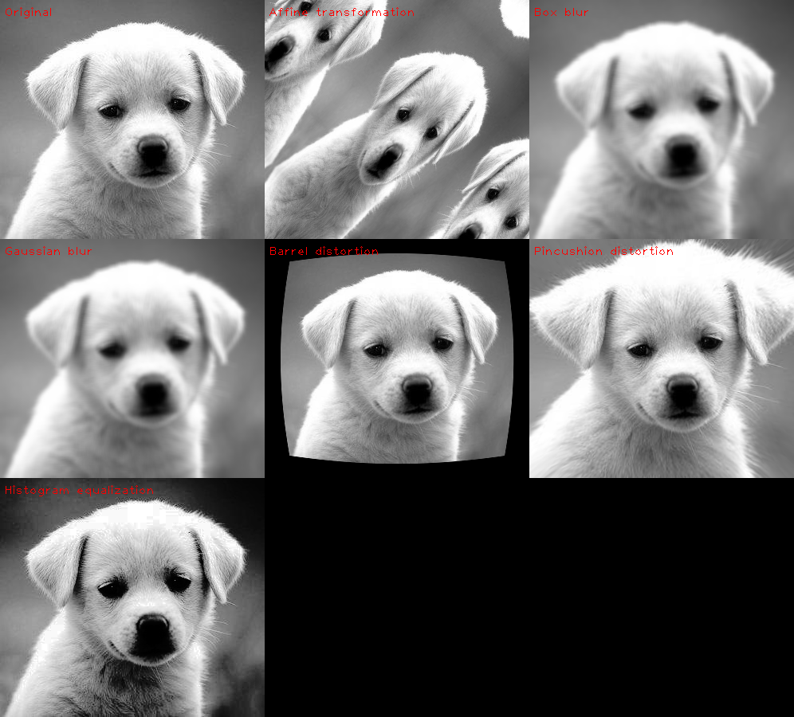

# cuImageOps

cuImageOps is a library for performing image operations on the GPU using CUDA



As simple as

```python
import cv2
import numpy as np
from cuImageOps.operations import Affine

image = cv2.imread("file.jpg")

result = Affine(translate=(10, 10), rotate=45, scale=(0.5, 1.0)).run(image).cpu().numpy()

cv2.imshow("Affine", result)
cv2.waitKey()

```

## Tests

Tests are located under the `tests` folder. You can run 

```
run_tests.sh
```

to run all tests.